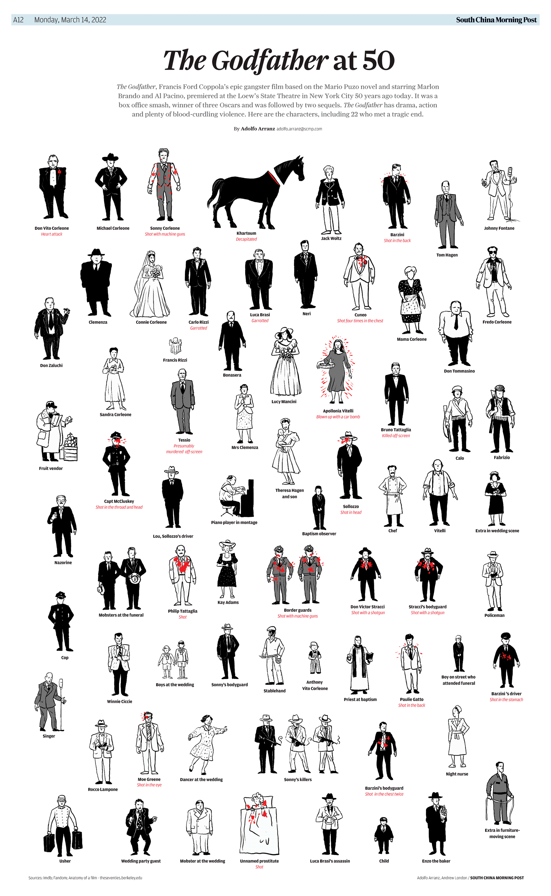
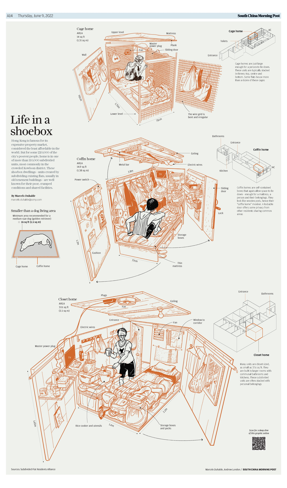
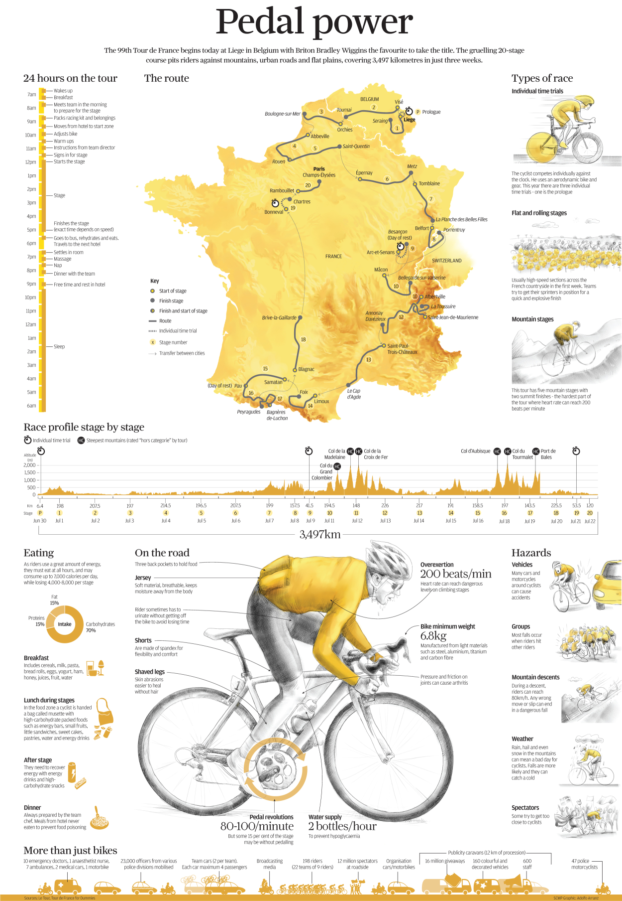
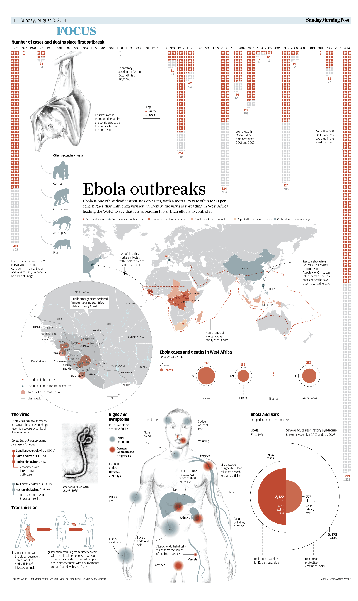
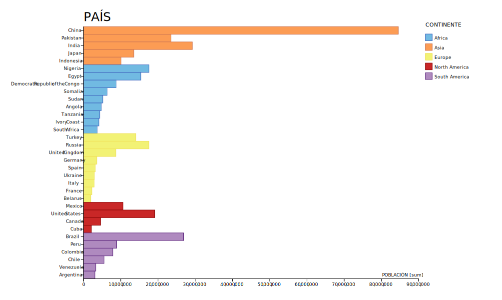

# infodigital-clase-03
<!DOCTYPE html>
<html lang="es">
    <head>
        <meta charset="utf-8">
        <meta name="viewport" content="width=device-width, initial-scale=1">
        <link href="https://cdn.jsdelivr.net/npm/bootstrap@5.1.3/dist/css/bootstrap.min.css" rel="stylesheet" integrity="sha384-1BmE4kWBq78iYhFldvKuhfTAU6auU8tT94WrHftjDbrCEXSU1oBoqyl2QvZ6jIW3" crossorigin="anonymous" />
        <link rel="preconnect" href="https://fonts.googleapis.com">
        <link rel="preconnect" href="https://fonts.gstatic.com" crossorigin>
        <link href="https://fonts.googleapis.com/css2?family=IBM+Plex+Sans:ital,wght@0,300;0,400;0,600;1,400&display=swap" rel="stylesheet">
        
        <title>Reemplaza este título que se muestra en la ventana de tu navegador</title>
    </head>
    <body class="bg-dark text-white">
        <header class="container">
            

                

                    <h1 class="mb-3 mt-5 text-center">CLASE 3</h1>
                    <h2 class="mb-5 text-center text-uppercase fs-6 text-white-50">Olivia Bacigalupo & Manuela Munchmeyer</h2>
                    
Las gráficas en las infografías nos permiten acercarnos de una manera visual a la información y procesarla rápidamente.
                    Existen tres tipos de gráficas que se usan para representar la información y que veremos a continuación.

                

            

        </header>
        <main class="container">
            

                

                    

                    <h3 class="text-center my-5">GRÁFICA FIGURATIVA</h3>
                    
En la Gráfica figurativa se representan la información a través de imágenes, ilustraciones, simbolos, etc y permite entenderla y procesarla de una manera más simple, visual y rápida. "Gráficos figurativos son aquellos que representan fenómenos físicos; en ellos generalmente existe una cierta similitud entre lo representado y la forma visual" (Cairo, 2011:31).

                
                
                <!--primera imagen-->
                

                    <figure class="shadow bg-black">
                        
                        <figcaption class="p-3 small text-white-50">"The Godfather at 50", 2022.</figcaption>
                    </figure>
                

                <!--segunda imagen-->
                

                    <figure class="shadow bg-black">
                        
                        <figcaption class="p-3 small text-white-50">"Bamboo Curtains", 2022.</figcaption>
                    </figure>
                

                <!--tercera imagen-->
                

                    <figure class="shadow bg-black">
                        
                        <figcaption class="p-3 small text-white-50">"Life in a shoe box", 2022.</figcaption>
                    </figure>
                

                <!--cuarta imagen-->
                

                    <figure class="shadow bg-black">
                        
                        <figcaption class="p-3 small text-white-50">"Subdivided flat living", 2022.</figcaption>
                    </figure>
                

                <!--no hay más imágenes-->
            

            

                

                    
                    
                    <h3 class="text-center my-5">GRÁFICA MIXTA</h3>
                    
La Gráfica mixta combina la Gráfica figurativa y la Gráfica no figurativa, en dónde podemos ver mucha información y datos en gráficos que nos permite dimensionar la información junto a imágenes o ilustraciones para visualizar el contexto.

                

                <!--primera imagen-->
                

                    <figure class="shadow bg-black">
                        
                        <figcaption class="p-3 small text-white-50">"Pedal power", 2022.</figcaption>
                    </figure>
                

                <!--segunda imagen-->
                

                    <figure class="shadow bg-black">
                        
                        <figcaption class="p-3 small text-white-50">"Ebola outbreaks", 2014.</figcaption>
                    </figure>
                

                <!--no hay más imágenes-->
            

            

                

                    

                    <h3 class="text-center my-5">GRÁFICA NO FIGURATIVA</h3>
                    
La Gráfica no figurativa es capaz de abstraer datos e información y llevarlos a una configuración visual que muestra lo que en realidad no se puede ver, donde las estadísticas se logran visualizar, "Con los gráficos no figurativos se puede convertir la cantidad estadística en una cualidad visible" (Boehm, 2010, p.104).
                    
                

                <!--solo un gráfico-->
                

                    <figure class="shadow bg-black">
                        
                        <figcaption class="p-3 small text-white-50">Gráfico de Población en cada Continente.</figcaption>
                    </figure>
                

                

                    
La gráfica de arriba se despliega en la página como si se tratara de una imagen rasterizada, con el elemento <a href="https://developer.mozilla.org/es/docs/Web/HTML/Element/img" target="_blank">&lt;img&gt;</a>. Otros elementos de HTML podrían usarse para un mejor despliegue del SVG. Reviseramos tales elementos algunas clases más adelante, pero ya les conviene revisar <a href="https://css-tricks.com/using-svg/" target="_blank">Using SVG | CSS Trick</a>.

                

            

        </main>
        <footer>
            

                

                

                        

                            <a href="https://github.com/profesorfaco/dno075-2022-2/">Infografía Digital</a>
                            <a href="https://github.com/profesorfaco/dno075-2022-2/tree/main/clase-03">Lunes 22 de agosto, 2022</a>
                        

                    

                

            

        </footer>
        
    </body>
</html>
